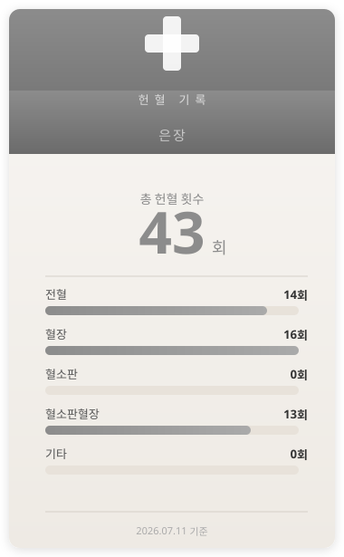
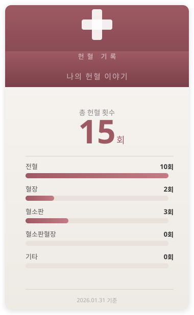
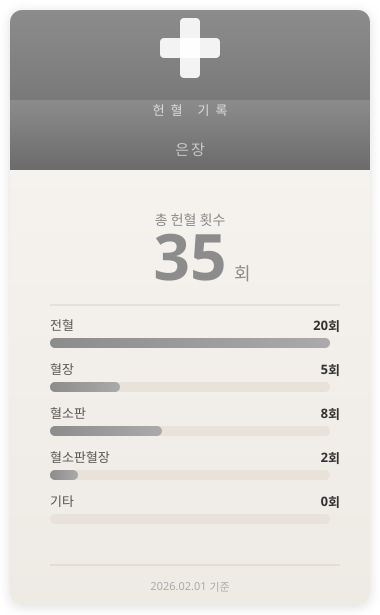
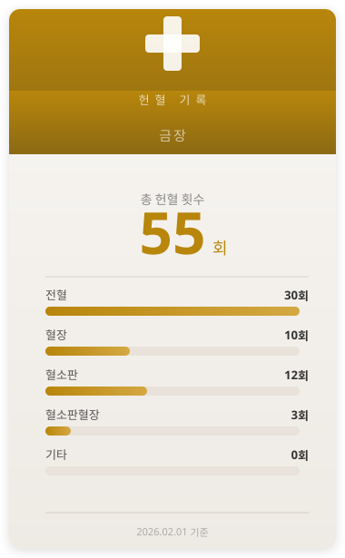
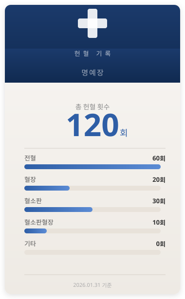
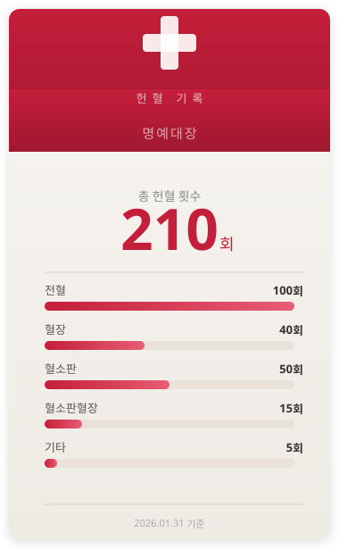
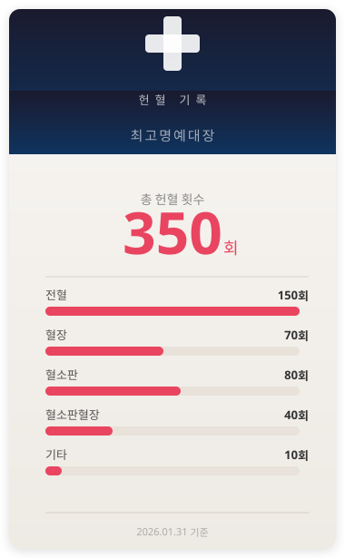

# Blood Record

대한적십자사 혈액정보공유서비스에서 헌혈 기록을 크롤링하여, 헌혈 유공패 스타일의 카드 이미지를 자동으로 생성하는 GitHub Actions 프로젝트입니다.



## 만든 이유

2021년 헌혈을 시작한 지도 벌써 몇 년이 지났습니다. 꾸준히 헌혈에 참여하면서, 그 기록을 GitHub 프로필에 남기고 싶다는 생각이 들었습니다.

헌혈은 누구나 쉽게 참여할 수 있는 나눔입니다. 이 프로젝트를 통해 더 많은 분들이 헌혈에 관심을 갖고, 나눔의 뜻에 동참해 주시면 좋겠습니다.

[헌혈의집 찾기](https://bloodinfo.net/knrcbs/bh/hous/srchBldHousList.do?mi=1059)

## 등급별 카드 미리보기

헌혈 횟수에 따라 카드 색상이 달라집니다. 대한적십자사 헌혈 유공패 등급 기준을 따릅니다.

| 등급 | 기준 | 미리보기 |
|------|------|----------|
| 기본 | 30회 미만 |  |
| 은장 | 30회 이상 |  |
| 금장 | 50회 이상 |  |
| 명예장 | 100회 이상 |  |
| 명예대장 | 200회 이상 |  |
| 최고명예대장 | 300회 이상 |  |

## 내 GitHub 프로필에 카드 넣기

이 프로젝트를 fork한 뒤, 본인의 GitHub 프로필 README에 아래와 같이 이미지를 추가하면 됩니다.

```markdown

```

`{username}`을 본인의 GitHub 아이디로 바꿔주세요.

## 설정

### GitHub Secrets

Repository Settings → Secrets and variables → Actions에서 다음 시크릿을 추가해 주세요.

| Name | Description |
|------|-------------|
| `BLOODINFO_ID` | 대한적십자사 혈액관리본부 로그인 ID |
| `BLOODINFO_PW` | 대한적십자사 혈액관리본부 로그인 비밀번호 |

### 실행

Actions 탭 → "Update Blood Donation Card" → Run workflow 버튼으로 수동 실행할 수 있습니다.

### cron 추가

자동 실행이 필요하시면 `.github/workflows/update-badge.yml`의 `on:` 섹션에 schedule을 추가해 주세요.

```yaml
on:
  workflow_dispatch:
  schedule:
    - cron: "0 15 * * 1"  # 매주 월요일 자정(KST) 실행
```

> **주의**: 빈번한 스케줄은 대한적십자사 서버에 불필요한 부하를 줄 수 있습니다. 주 1회 이하를 권장합니다.

## 로컬 테스트

```bash
pip install -r requirements.txt

# 크롤링 (환경변수 필요)
export BLOODINFO_ID="your_id"
export BLOODINFO_PW="your_pw"
python scripts/crawl.py > data.json

# 카드 생성
python scripts/generate_card.py < data.json
```
